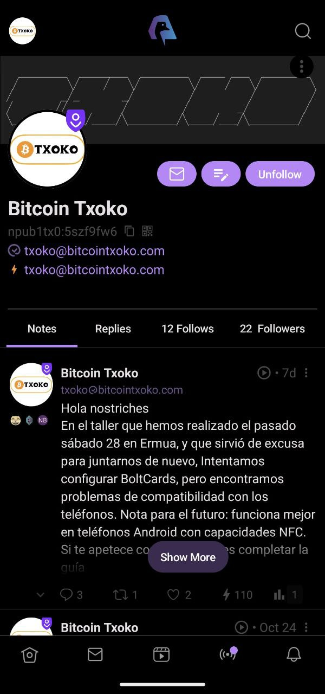
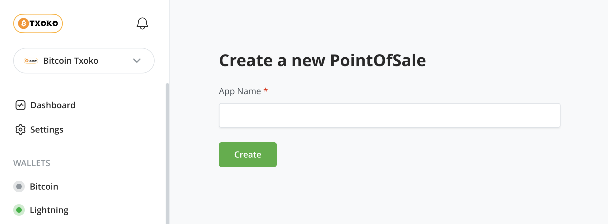

## Square logo
The logo will be used everywhere from social media profiles to merch so it's rather important! You can take a look at current logos [here](https://github.com/bitcointxoko/logos). 

This is our current logo in a square format. 

### Context
  

Profile page on Amethyst, a popular Android nostr client. 

  

Profile page on Damus, a popular iOS nostr client. 

The checkout screen at the online shop. 

### Requirements
- a square webp or png image

## Rectangular logo

  

This is our current rectangular logo in a pill shape. 

It can appear on the wallet page... 

... and the shop page. 

### Requirements
- a rectangular webp or png image

### Suggested approach
One way to do this is to make the rectangular logo and just arrange the margins around it to fit into a square for the square logo. This is what I'm doing now because I'm lazy. If you can come up with a better approach that of course would be much appreciated!
