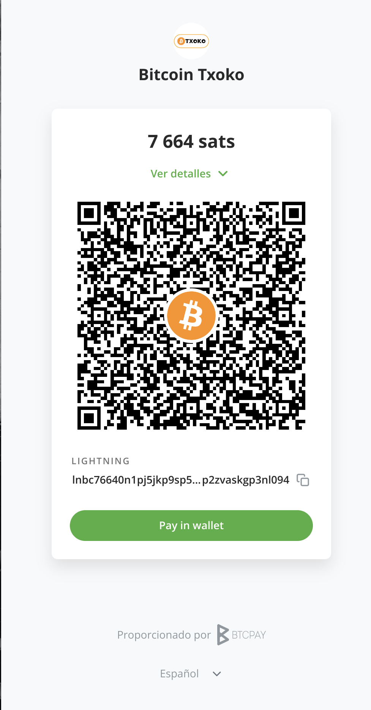
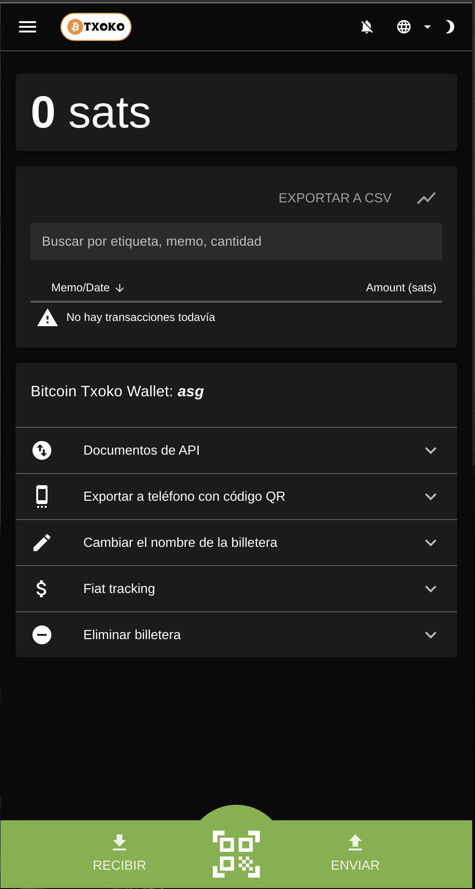

## Square logo
The logo will be used everywhere from social media profiles to merch so it's rather important! 

You can take a look at current logos [here](https://github.com/bitcointxoko/logos). 

### Context
  

Profile page on Amethyst, a popular Android nostr client. 

  

Profile page on Damus, a popular iOS nostr client. 

The checkout screen at the online shop. 

### Requirements
- a square image

## Rectangular logo

The rectangular logo can appear on the wallet page... 

... and the shop page. 
