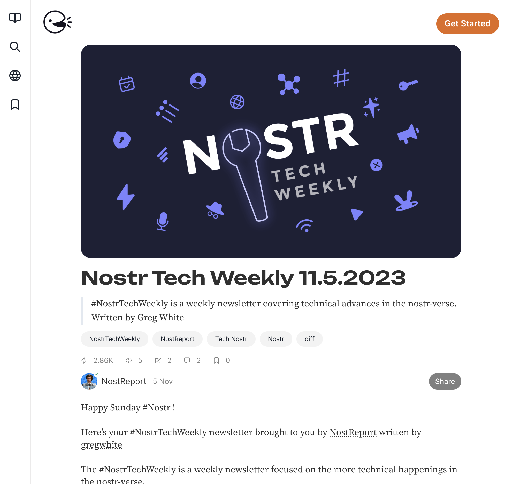
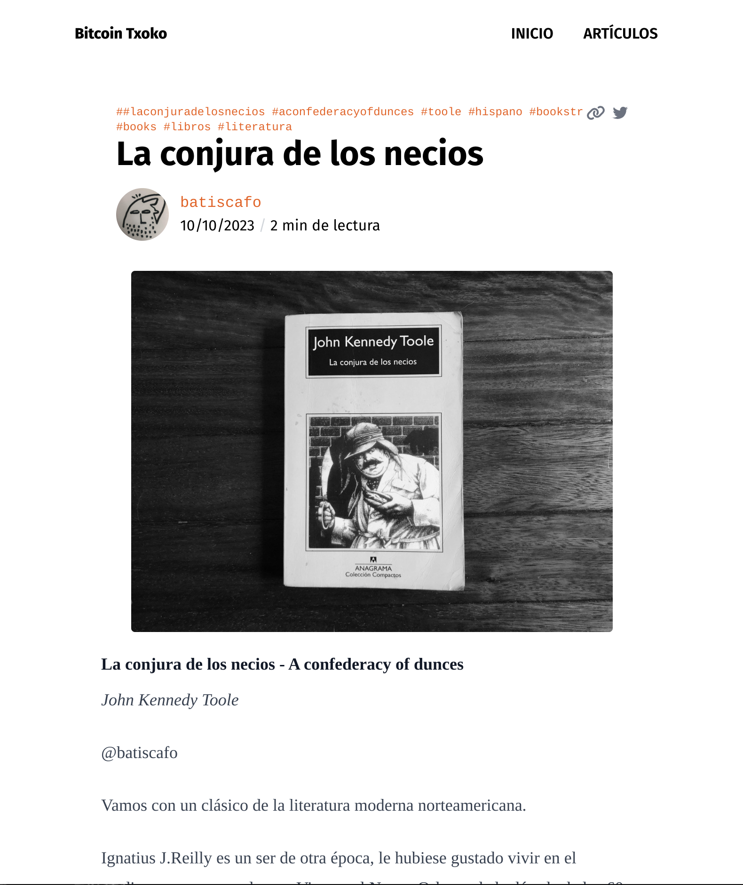
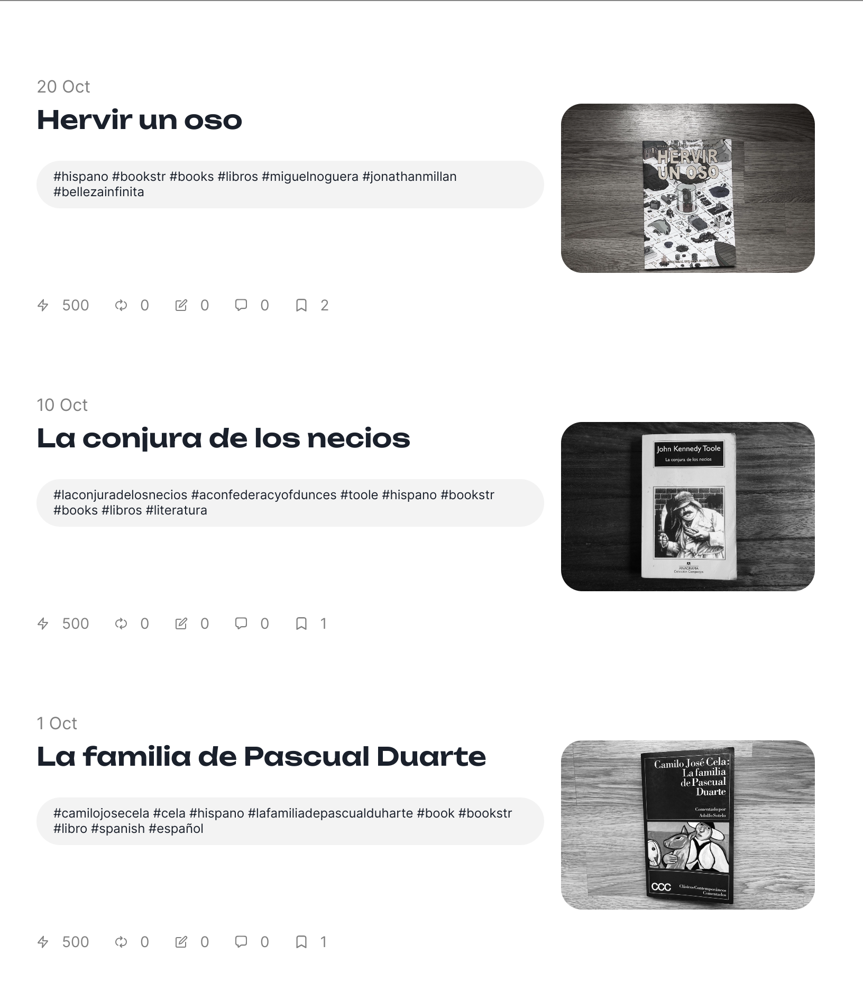

## Article Banners
Article banners are used on the long-form publications published by Bitcoin Txoko. For the moment, these include guides and explainers. A clean article banner would make the blog much more visually appealing. It can also convey useful information and make it a better user experience for the reader. For example, the article banner for a guide can contain icons to indicate difficulty, time and tools required, icons to help users identify the technology they are learning about, like app icons. 

### Requirements
- I think a webp or png in 7:4 would be great. 

### Example

This is how the banner is displayed on Habla, a popular long-form web client.

  

This is how the banner is displayed on our blog page at https://blog.bitcointxoko.com

  

Batiscafo writes book reviews and uses the article banner to show book covers. 

### Suggested approach
I suggest making a template, for exmaple with the logo on a background, and leave space for adding icons to indicate difficulty, time required, app icons, platforms supported etc. This way we can reuse the template for each guide or explainer that we publish. The background design and the way icons are arranged on the template are up to you. 
