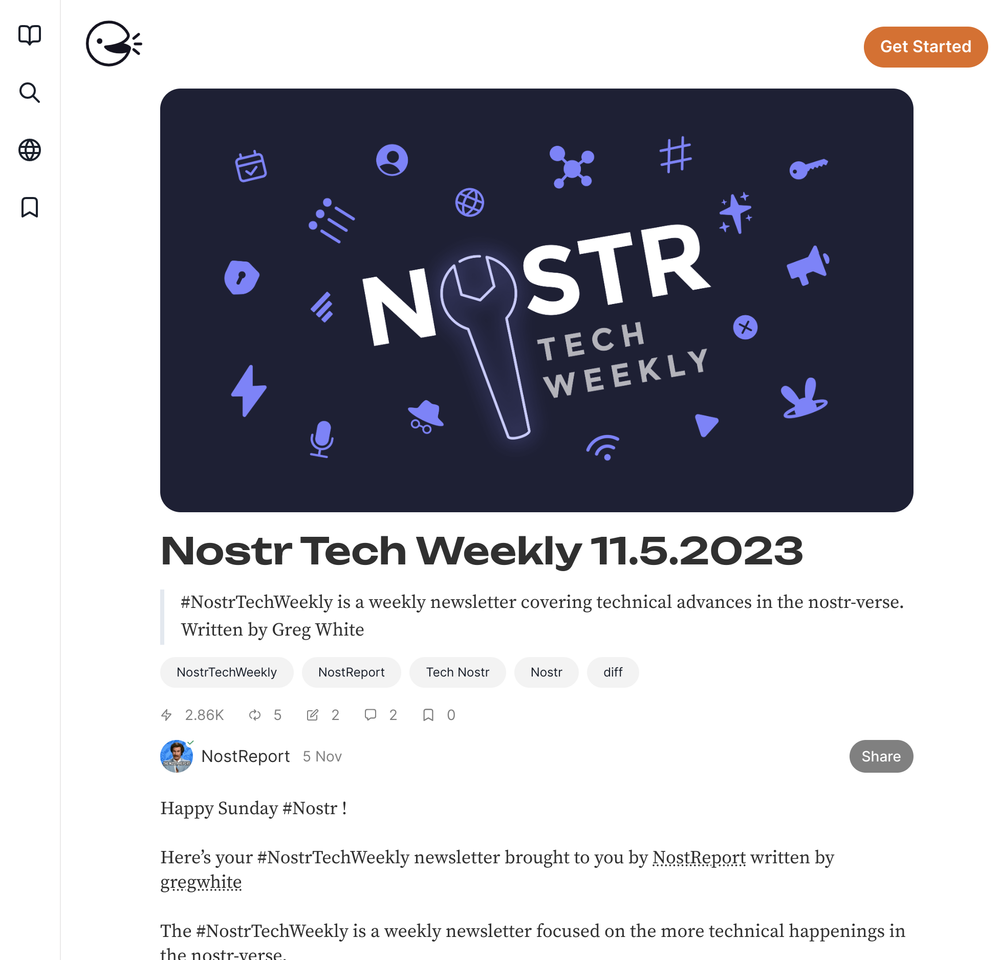
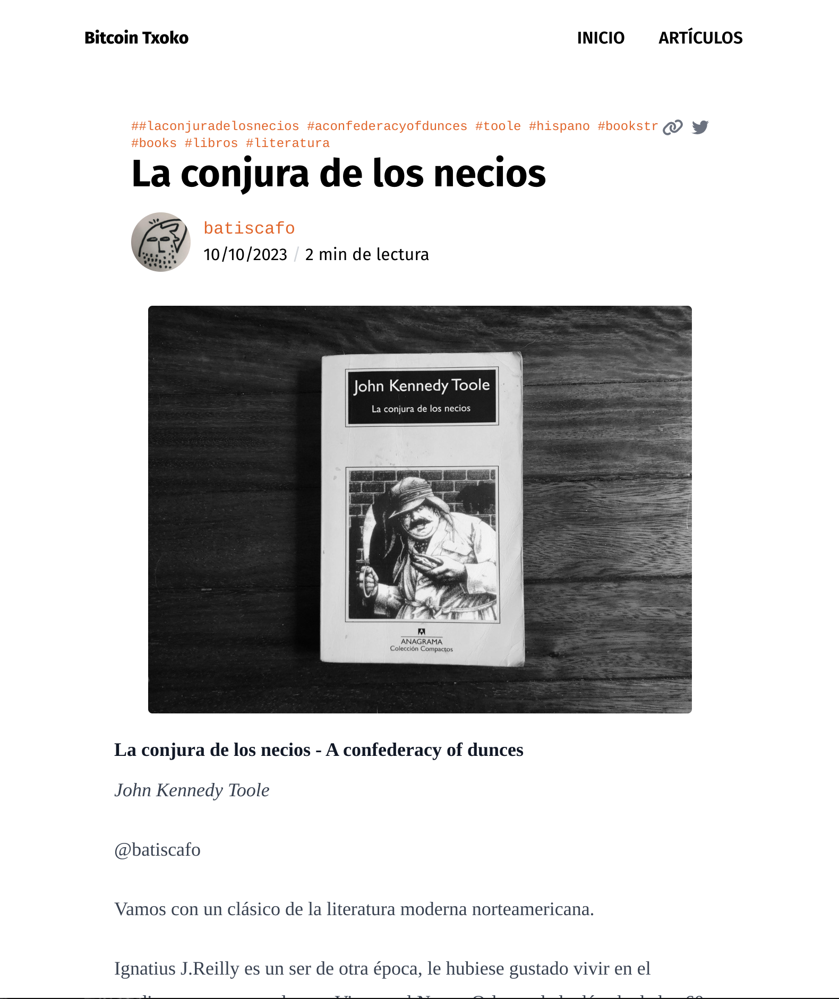

## Article Banners
Since Bitcoin Txoko is frequently writing guides and explainers, a clean article banner would make the blog much more visually appealing. It can also convey useful information and make it a better user experience for the reader. For example, the article banner for a guide can contain icons to indicate difficulty, time and tools required, icons to help users identify the technology they are learning about, like app icons. 

### Example

This is how the banner is displayed on Habla, a popular 

  

This is how the banner is displayed on our blog page at https://blog.bitcointxoko.com

  

Batiscafo writes book reviews and uses the article banner to show book covers. 

### Requirements
- I think 7:4 would be great. 
