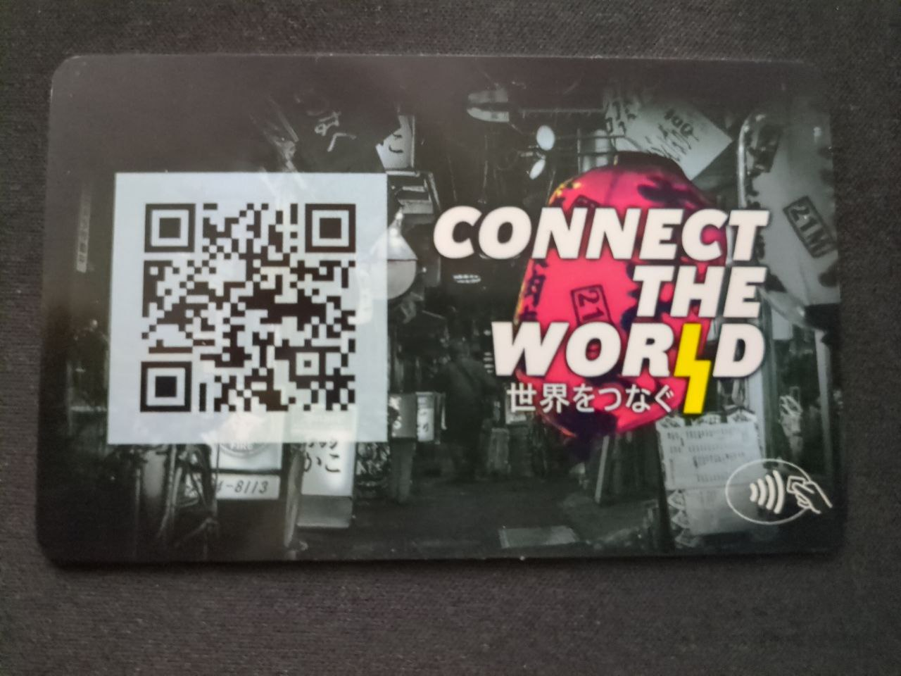

## BoltCard
A [BoltCard](https://boltcard.org/) is a NFC card that can make Bitcoin Lightning Network payments, kind of like a Lightning debit card ([demo](https://www.youtube.com/watch?v=jLsZ9faRstY)). Community members can create their own cards using the [wallet](https://bitcointxoko.com/) hosted by Bitcoin Txoko. We're currently offering white PVC cards for sale on our [shop](https://shop.bitcointxoko.com) page. It would be really cool if we can also offer a couple of designs and profits from card sales can be used to fund the designer(s). 

### Requirements
Requirements: 
- rounded rectangle 85.5 mm x 54 mm (two sides per card)
- two or three designs, including at least one "discreet" design with no obvious connection to bitcoin
- (optional) integrate a 30 mm x 30 mm blank cutout for QR codes into the design

### Suggested approach
The NFC card uses the same form factor that of a credit card or public transit card, so you can use one of those to trace an outline if desired. 

Since the wallets backing these BoltCards can have a receiving address too, these can be integrated into the card design in the form of a QR code on the back side of the card. This way the cardbearer can not only use their cards to spend but to receive as well. Consider making a blank square cutout in the card design where the QR code can be printed. 

### Examples

A blank NFC card looks like this. 

An example design from the [Baltic Honeybadger](https://baltichoneybadger.com/) conference in Riga, Latvia. The badgers' eyes even light up upon NFC contact!

An example design from the [Connect the World](https://connecttheworld.live/) podcast with an integrated QR code. 
